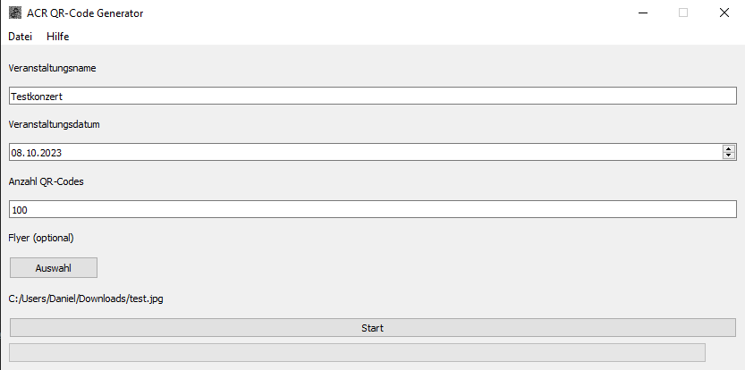

# 🏭 QR-Code Generator

Der Generator erstellt QR-Codes, die als E-Tickets für Veranstaltungen genutzt werden können.

## ⚡ Quick Start

1. Starte das Programm *ACR_QR_Generator.exe*
2. Klicke den *Neu generieren* Button in der geöffneten Infobox
3. Lege den Namen der Veranstaltung, das Datum* und die Anzahl der gewünschten QR-Codes fest
4. Drücke den *Start* Button, um die Generierung zu starten
5. Wenn die Generierung abgeschlossen ist, kann der Ausgabeordner über die Infobox geöffnet werden

\* Sollte die Veranstaltung auf ein anderes Datum verschoben werden ist dies nicht weiter schlimm. Es muss dann im Scanner lediglich das ursprüngliche Veranstaltungsdatum konfiguriert werden. 

*Beispielkonfiguration*

## ⚙ Konfiguration

Über das Menü *Datei > Ausgabeordner wählen* kannst du den Ausgabeordner, in den die QR-Codes generiert werden, ändern. Änderungen des Ausgabeordners bleiben nach Neustart des Programms bestehen.

## 🔐 Sicherheit

> **_⚠️_** Bitte ließ diesen Abschnitt gründlich, um zu verhindern, dass Tickets gefälscht werden können

Beim erstmaligen Starten des Generators wird durch einen Klick auf den *Neu generieren* Button ein asymmetrisches Schlüsselpaar erstellt. Dieses besteht aus einem privaten Schlüssel (private key) und einem öffentlichen Schlüssel (public key).

Der Generator benutzt den private key, um die QR-Codes digital zu signieren. Der public key hingegen wird vom Scanner genutzt, um die Signatur zu verifizieren. Dieses Vorgehen stellt sicher, dass niemand, der nicht im Besitz des private keys ist, in der Lage ist gefälschte QR-Codes zu generieren. Der Ordner mit den generieren Schlüsseln kannst du über das Menü *Datei > Key Ordner öffnen* öffnen. Wenn du das Programm neu startest, wird der bereits generierte private key automatisch wieder verwendet.

> **_⚠️_** Stelle sicher, dass niemand Unbefugtes Zugang zu dem private key erlangt. Z.B., indem du ihn auf einem Gerät speicherst zu dem nur ausgewählte Personen Zugang haben oder indem du ihn durch ein Passwort sicherst.

Solltest du den private key an einem anderen Ort speichern wollen als der Standardordner ist dies möglich. Verschiebe dazu den private key einfach an den gewünschten Ort und wähle beim Start des Programms in der Infobox den *Importieren* Button, um dem Programm mitzuteilen, wo der private key sich befindet. Der festgelegte Ort wird bei Neustart des Programms wieder verwendet.

Wie bereits oben erwähnt, nutzt der Scanner den public key, um die Signatur in den QR-Codes zu überprüfen. Den public key musst du dazu manuell auf das Gerät mit dem Scanner transferieren. Dieser Transfer ist, sofern sich der private key nicht ändert, nur einmal notwendig. Es macht also Sinn, den private key nicht unnötig neu zu generieren, um nicht ständig den public key auf das Scanner Gerät transferieren zu müssen. Für den public key sind keine besonderen Schutzmaßnahmen notwendig. Er kann also bedenkenlos verteilt werden. 

Sollte es doch dazu kommen, dass jemand Unbefugtes Zugriff auf den private key bekommt, ist es zwingend notwendig einen neues Schlüsselpaar zu generieren. Dazu musst du den alten private key von seinem Speicherort entfernen und den Generator starten. Dann öffnet sich erneut die Infobox, über welche die Schlüssel generiert werden können. Denke daran den neuen public key auf alle Scanner-Geräte zu übertragen.

## 🔍 Technische Details
Folgende Informationen sind in den generierten QR-Codes gespeichert:
* Veranstaltungsname
* Veranstaltungsdatum
* ID
* Signatur

Veranstaltungsname und Veranstaltungsdatum dienen dazu die Veranstaltung eindeutig zu identifizieren. Die ID macht jedes Ticket einzigartig und verhindert, dass mehrere Personen den gleichen QR-Code verwenden können. Die Signatur verhindert, dass die QR-Codes gefälscht werden können.
